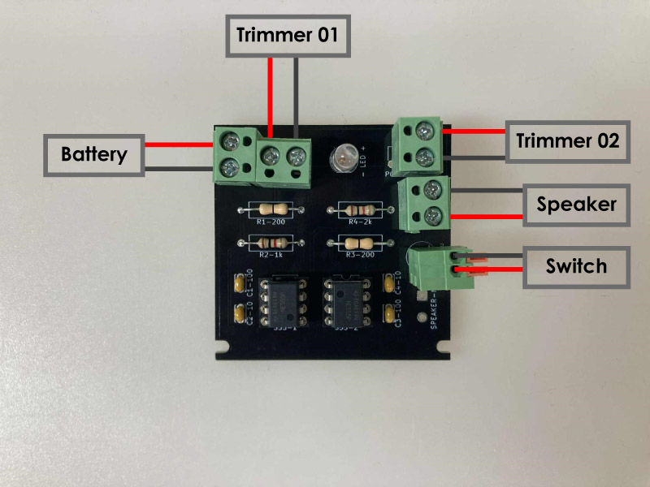

# Atari Punk Console

Atari Punk Console (アタリ・パンク・コンソール)、略してAPCは、レトロゲームのような音を出力するシンセサイザー回路。

## パーツの繋げ方

今回用意したAPCボードは以下のパーツを接続することで、機能する 
- **Battery** : 電池ボックス(単三４本、6V) x 1個
- **Trimmer01 & Trimmer02** : トリマー(可変抵抗) x 2個
- **Switch** : スイッチ x 1個
- **Speaker** : 小型スピーカー x 1個

## 各パーツのRhinoファイル
各パーツの3Dモデルとケースへの固定方法の例を作成した。下記リンクよりそれぞれダウンロードできる。

- [Battery(電池パック)](./3dfiles/battery_pack.3dm)
- [Trimmer(トリマー)](./3dfiles/potentiometer.3dm)
- [Switch(スイッチ)](./3dfiles/switch.3dm)
- [Speaker(スピーカー)](./3dfiles/piezo_speaker.3dm)
- [APCボード](./3dfiles/APC_board.3dm)

## ケースの作例
上記で紹介した各パーツの固定方法を利用した活用方法の一例を紹介する。 
下記リンクよりダウンロードできるので、必要あれば参照すること。

- [APCケースのサンプル](./3dfiles/APC_sample_case.3dm)
