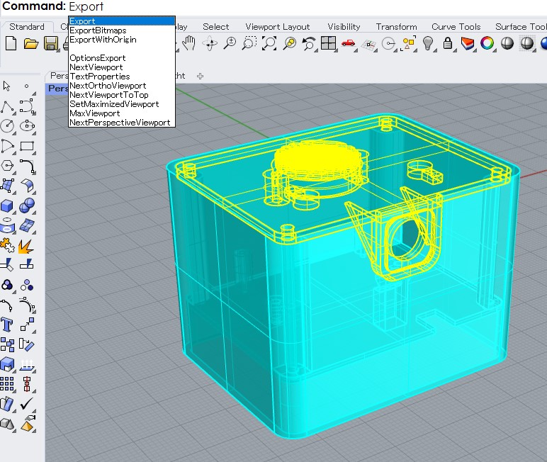
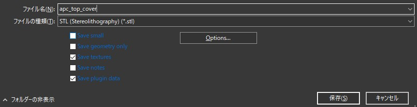
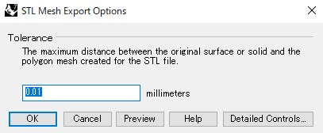
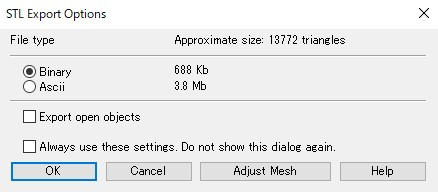
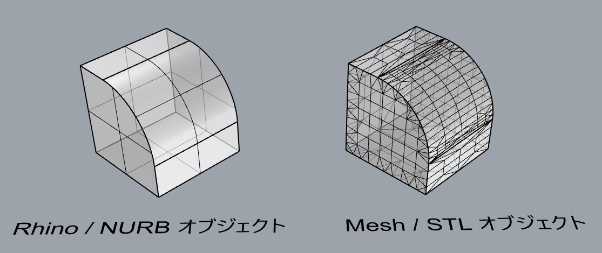

# STLファイルの書き出し

3Dプリントの下準備として、プリントしたいモデルをSTLという形式で保存しておく必要がある。 
Rhinoceros上では以下の手順でSTLファイルを書き出すことが出来る。

まず、STLファイルとして書き出したいオブジェクトを選択し、**Export**コマンドを使用する。 
(ウィンドウメニューの **ファイル > 選択オブジェクトをエクスポート** でも同じことが出来る。)

ファイルの保存先とファイル名(半角英数字推奨)を設定し、 
ファイルの種類から**STL**を選択し、保存ボタンをクリック。

Tolerance(許容値)ウィンドウが表示されるので、今から使う3Dプリンタの精度よりも低い値を入力する。 
余りに小さくし過ぎると、データが重くなるので注意。

例：造形精度が±0.1mmのプリンタなら、0.05~0.01mmにするのがオススメ。

次に、STLの保存形式について聞かれる、以前はAscii(アスキー)形式でないとデータを読み込めない3Dプリンタも存在したが、現在はほぼ全てのプリンターがBinary(バイナリー)形式に対応しているので、Binaryを選択。 
こちらの方がデータ量も軽くなるし、精度に関してはどちらも変わらない。

### ちなみに：RhinoデータとSTLデータの違い

Rhinoデータは**NURB(ナーヴ)形式**とよばれる手法でモデル形状を、数式的に曲線・曲面の形状が表現されているためどこまでズームしてもオブジェクトの滑らかさが損なわれない。 
これに対し、STLデータは**Mesh(メッシュ)形式**、つまりポリゴンで形状を表現するためズームしていくと三角形の平面で分割され、全てが直線的に表現されているために、カクカクとした粗さが目立つ。 

STLファイルを書き出すときにTolerance(許容値)を設定するのは、ポリゴンで元のNURB形状を完全に再現することは事実上不可能であり、それでも元のモデル形状へ近似するためにどれくらいポリゴンを細かくするか？を決める為だったことがココから分かる。