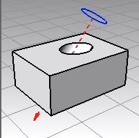

# Rhinoコマンドリスト
今回のWSで覚えておくと便利なRhinoコマンドをまとめておきます。

### [Import](https://docs.mcneel.com/rhino/8/help/en-us/commands/insert.htm#Import)

編集中のRhinoファイルへ別のRhinoファイルを取り込むためのコマンド。配布されたモデルデータや他の人が作った3Dモデルを利用する時に重宝する。

### [DupEdge](https://docs.mcneel.com/rhino/8/help/en-us/commands/dupedge.htm?Highlight=dupedge)
既存のオブジェクトの輪郭線をカーブとしてコピーできる。複数カーブをこのコマンドで取り出すとバラバラなっているので、Joinコマンドで繋げておくと良し。

### [MakeHole](https://docs.mcneel.com/rhino/8/help/en-us/commands/makehole.htm?Highlight=makehole)
輪郭線を元に対称のオブジェクトに穴を開けるコマンド。貫通はもちろん、オブジェクトとの途中に穴の深さを指定すればザグリ加工のような形状を手早く作れる。

### [Untrim](https://docs.mcneel.com/rhino/8/help/en-us/commands/trim.htm#Untrim)
逆に、このコマンドを使えばオブジェクトの穴を除去することもできる。

### Gumballでの面移動
Gumball使用中にオブジェクトをクリックすると全体が選択されてしまうが、Ctrl(MacならCMD)+Shiftキーを押しながらクリックすると、オブジェクトのサーフェイス・エッジ・頂点を個別に選択することが出来る。 
この状態で、Gumballの矢印を使って移動させるとオブジェクトの形状をダイレクトに編集できる。また、移動する時にMoveコマンドを組み合わせることも可能。 

[参考動画リンク](https://vimeo.com/260472052?fl=pl&fe=sh) 
※Gumballによる形状編集は動画中6:27から↑