# スライサーのパラメータ

## そもそもスライサーとは？
3Dプリンタは3Dモデルを直接受け取ってプリントを開始するわけではなく、その形状を効率よくプリントする為に計算されたノズルの動きや温度設定などの動作を細かに記された指示書を受け取ることで、はじめてプリントを開始する。この指示書はG-CODEと呼ばれ、メーカーによって若干名称は異なるものの、中身は下の画像のようなマシン用の命令が書き連ねられている。 

この3DモデルからG-CODEを生成するソフトウェアの事を、**スライサー**と呼ぶ。スライサーには、いろんな種類があり、好みのスライサーをカスタマイズしたりと奥深い世界ではあるが、最初は使用する3Dプリンタの純正スライサーを使用すると良い。手軽ですし。 

以下に、スライサーのパラメータの中でも重要なものを紹介していきます。 
使うソフトによって名前は若干異なりますが、どのソフトにも搭載されているはずです。 

## 造形サポート系パラメータ

### Brim (ブリム)
モデルの接地面積を広げるため、１層目の周囲に薄い膜をつけます。ブリムの幅を広げることも可能で、広いブリムほどモデルのビルドプレートへの接着力を補強できる。 
プリント後は大抵の部分を手で剥がすこともできるが、細かくバリのように残ることもあるのでカッターやヤスリでバリ取りをする必要がある。

|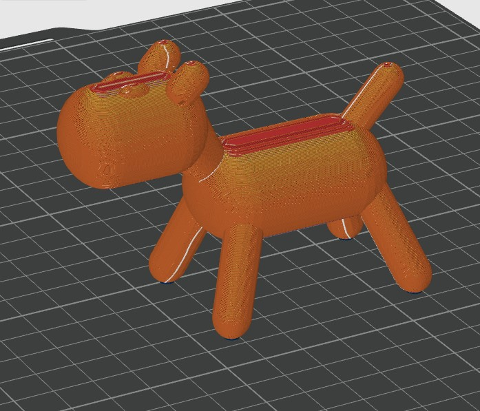|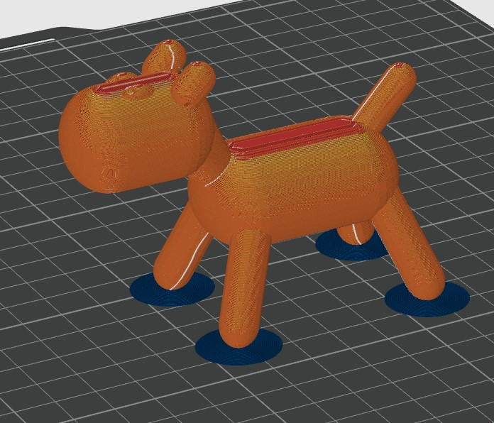|
|:--|:--|
|ブリムなし|ブリムあり(紺色の円盤部分)|

### Raft (ラフト)
ラフトもブリムと同様に接地面積を広げてモデルの接着力を補助するパラメータ。しかしこちらの方が、板のような固い土台を作ってくるれるので、プリント中の反りが強い時はラフトを使用する方が安定する。欠点は、ブリムよりもプリント時間がかかること。 

|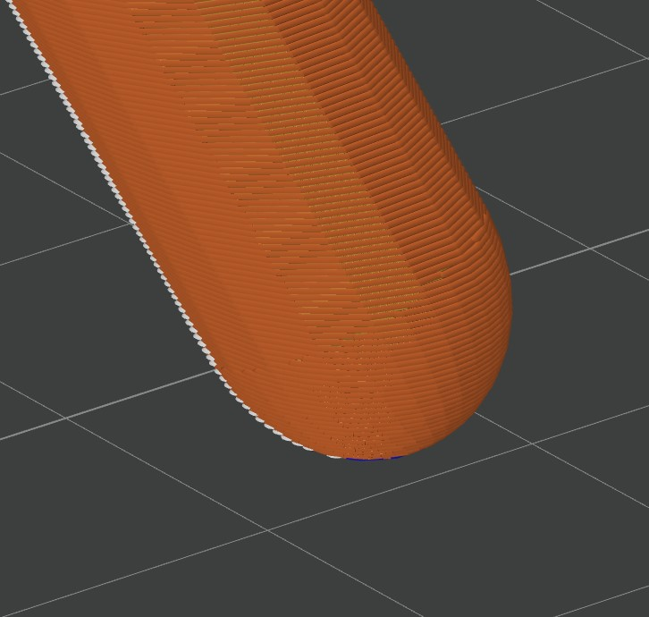|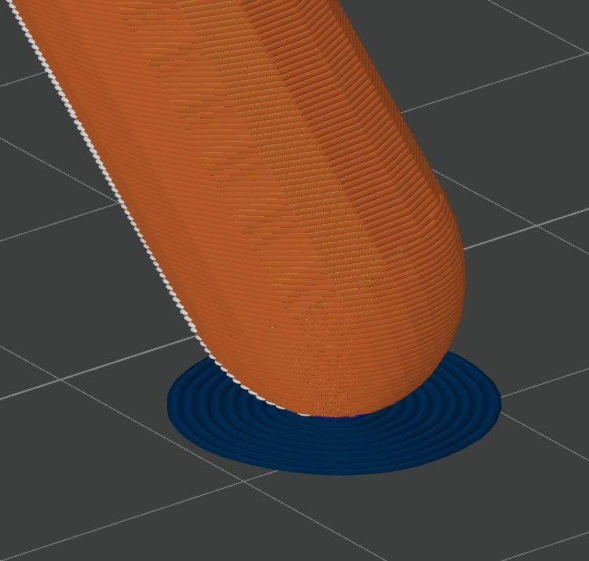|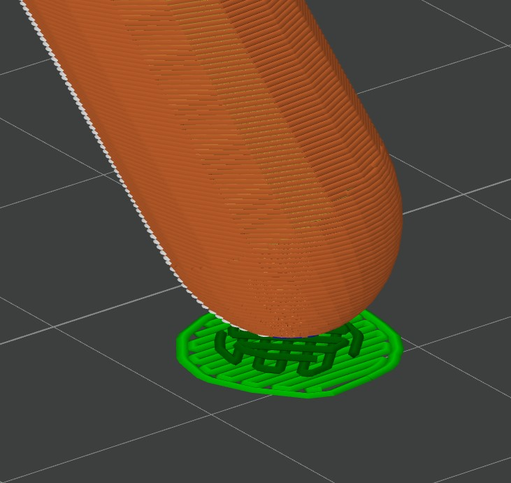|
|:--|:--|:--|
|オプションなし|ブリム|ラフト|

### Support (サポート)
中空にいきなり天井を作ることが出来ないのがFDM式3Dプリンタの欠点。それを可能にするにはプリント後に取り外せる **支え(サポート)** をモデルに付けて出力するしかない。とはいえサポートが付いていた部分は多少なりとも荒れるので、サポートが少なくなる方向にモデル設置してプリントするとか、サポートが省けるようにパーツ分割するとか、いろんな方法がある。 

|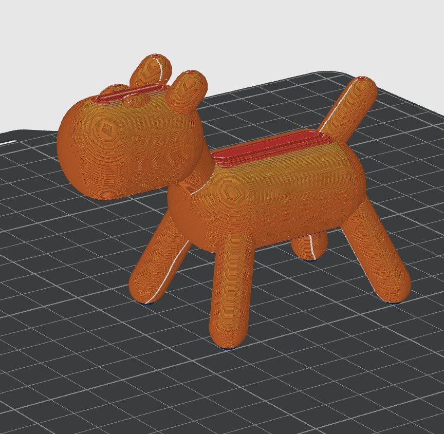|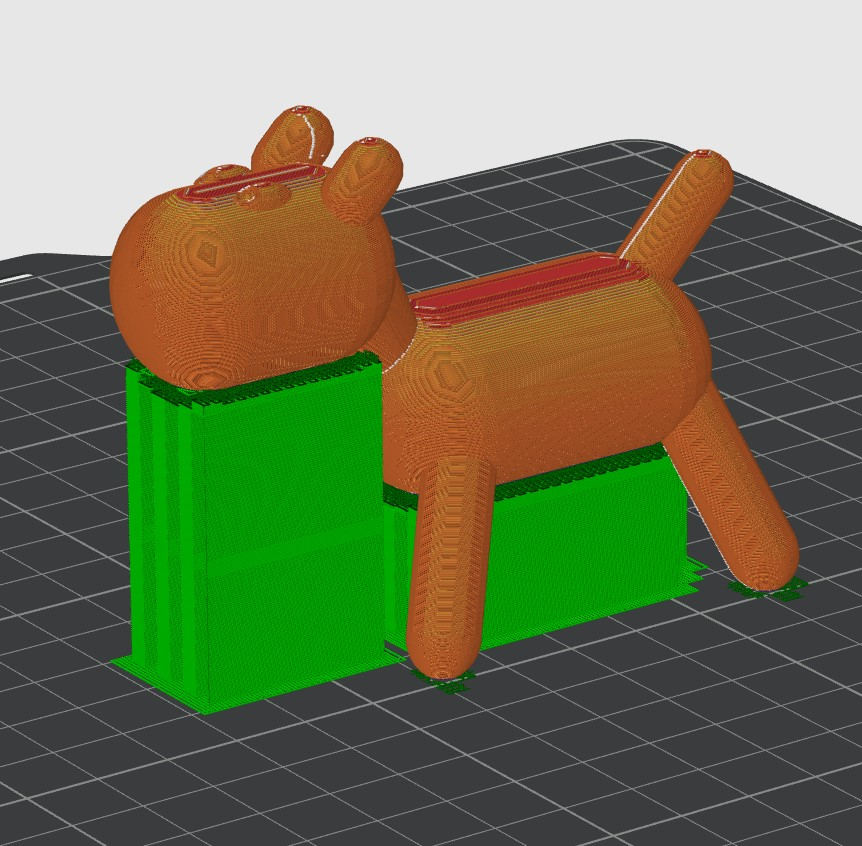|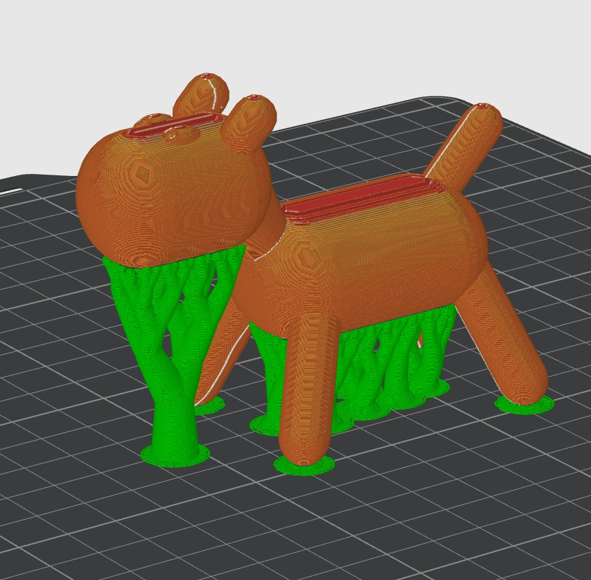|
|:--|:--|:--|
|サポートなし|通常サポート|ツリーサポート|
 

現在、サポートには２つの形状がある。 

**通常サポート** はブロック状のサポートパーツを生成してくれる。支えなくてはいけない部分が広く平らな場合は、こちらの方がオススメ。ツリーサポートよりも形状が安定しているので、プリント中に折れたりするリスクが少ない。 

**ツリーサポート** は樹木のように枝分かれしたサポートパーツになる。支える部分が有機的な湾曲した面である、もしくは狭い範囲・点で支えれば事足りる時はこちらの方がオススメ。取りやすく、プリントスピードも早くなる。 

## 品質系パラメータ

### Layer Height (レイヤー高)
**別名称：積層ピッチ、レイヤー厚み、など** 

Layer Heightは3Dプリンタが、積み重ねていく **層** の厚みを表すパラメータ。 厚くすればするほど、プリントが早く粗くなり、逆に薄くすればするほど滑らかに遅くなっていく。 

0.4mmノズルの3Dプリンタであれば、大体0.27mm ~ 0.8mmの間で調整することが可能でこれを変更することでプリントするモデルの滑らかさと出力時間が大きく変わる。 

プリントするモデルの使用用途、製作時間の上限などを加味して、自分に合った適切な厚みを設定する必要がある。

|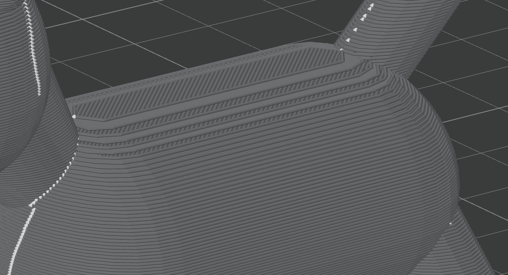|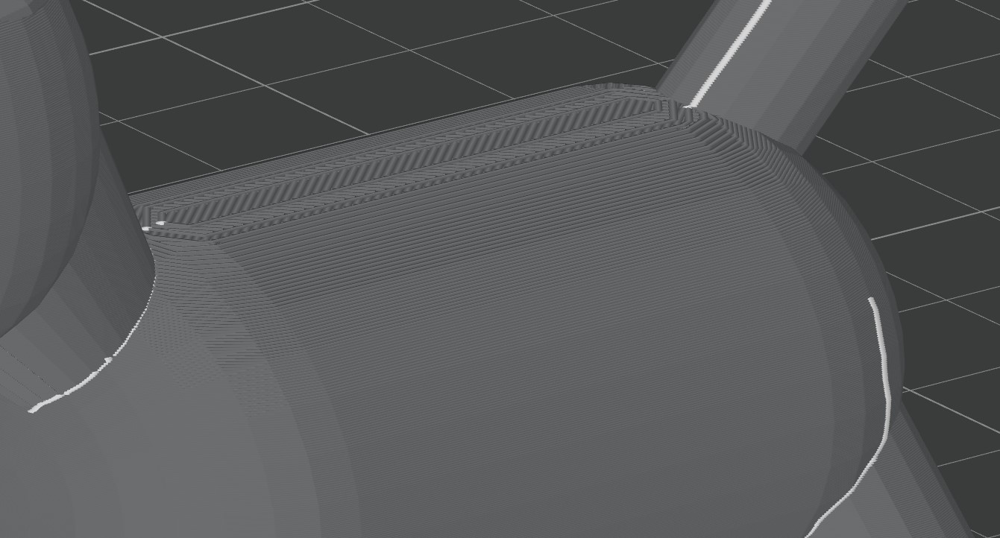|
|:--|:--|
|0.3mm積層|0.1mm積層|
 

↑　0.1mm積層の方が、0.3mm積層よりも段々畑のような部分が無くなり、モデル側面も滑らかになっている。 
その反面、0.1mm積層は0.3mm積層よりも同じ形状をプリントするのにも3倍時間がかかる。

## 強度系パラメータ

### infill (インフィル)
**別名称：充填密度など** 

3Dプリントされたモデルの内部は、下画像のようにみっちりと素材が充填されているわけではなく、出力時間の短縮のために格子状になっている。infill(インフィル)のパーセンテージを変えることで、この中身の密度を設定することができる。パーセンテージを上げれば上げるほど、密度を増し、頑丈にプリントできるが出力時間も長くなってしまうので注意。

|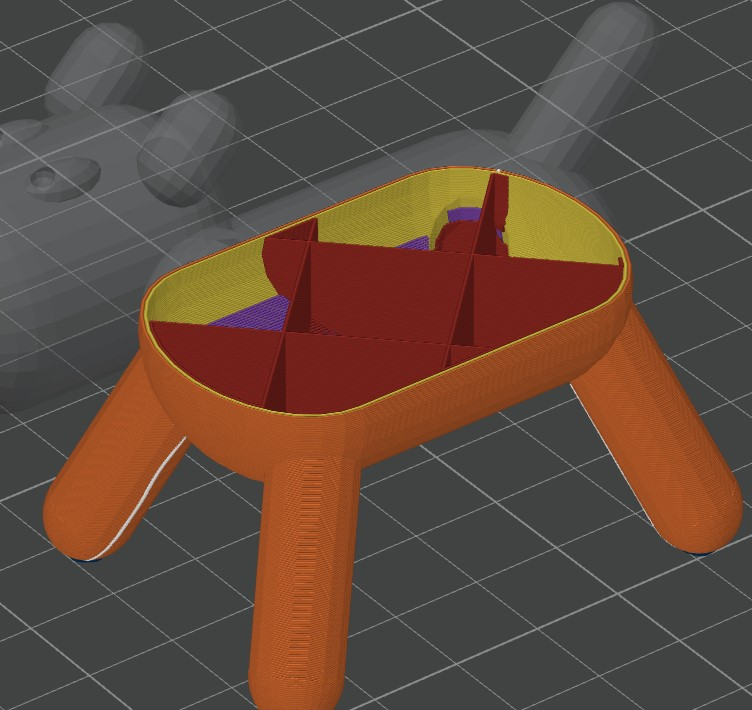|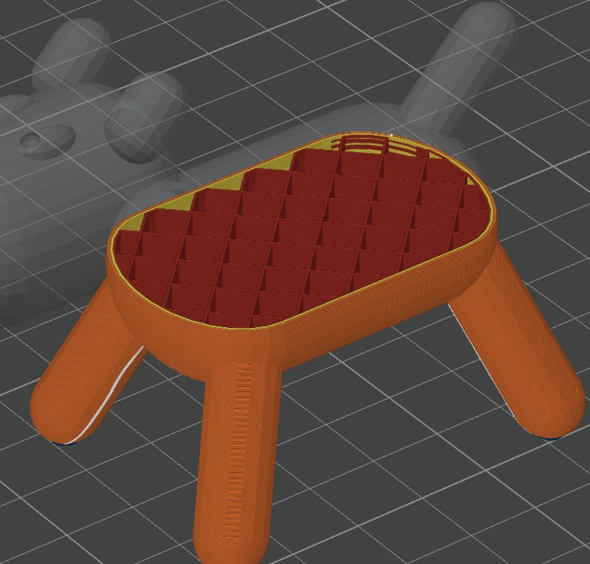|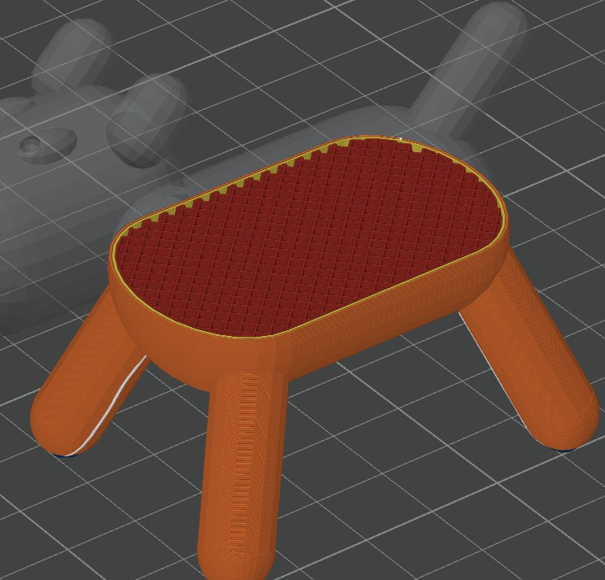|
|:--|:--|:--|
|infill 5%|infill 15%|infill 45%|
 

### infill (インフィルパターン)

infillの形状を変えることもできる。ただ模様が変わるだけでなく、強度やプリント時間といった要素にも影響が出る。代表的なパターンを３種類を上げておく。

|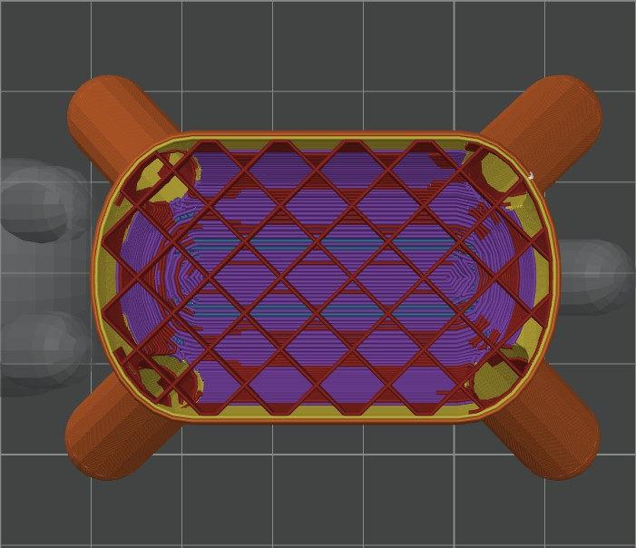|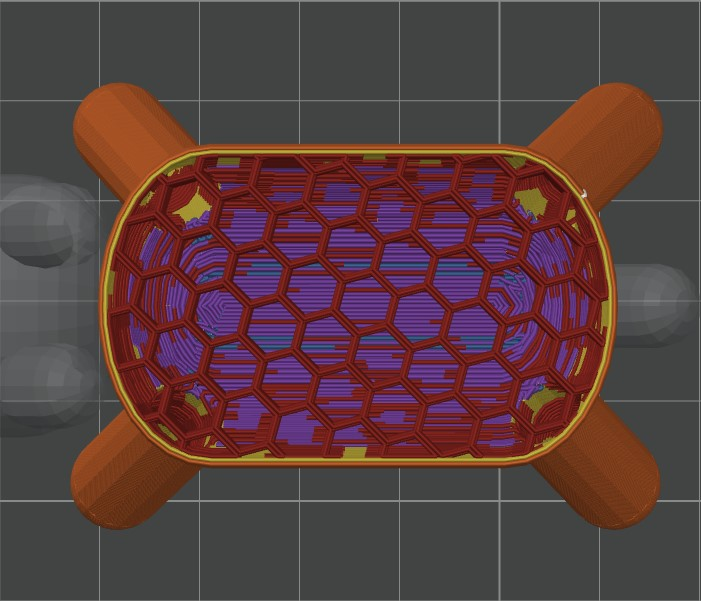|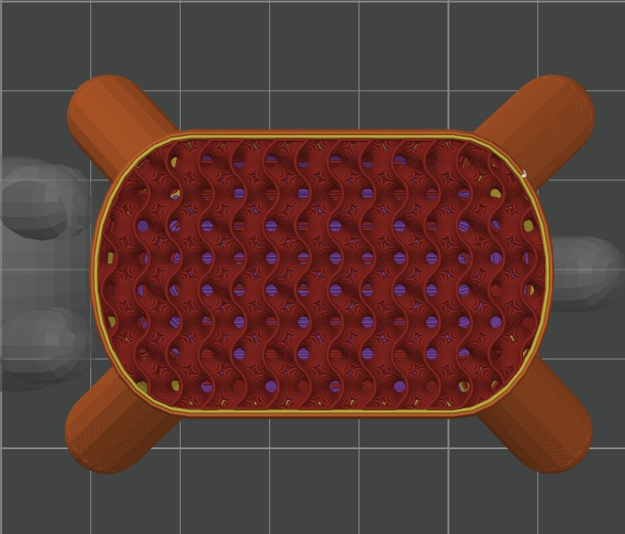|
|:--|:--|:--|
|Grid(グリッド)|Honeycomb(ハニカム)|Gyroid(ジャイロイド)|
 

**Grid(グリッド)**
シンプルでプリント時間も早いパターン。欠点としては、交差する部分に余分なフィラメントが蓄積して、プリント失敗の原因となる時が稀にある。

**Honeycomb(ハニカム)** 
機械的な強度を出すことが出来るパターンで、ノズルの軌道の交差も少なくすることが出来る。一方で、プリント時間が長く、素材の消費も多い。別名Hexagon、Hex。

**Gyroid(ジャイロイド)** 
全方向に対して強度を保つことが出来る。比較的プリント時間も早く、ノズルの軌道が交差しないため出力中にノズルがモデルにぶつかることで失敗するリスクも低い。

より多くのインフィルパターンの解説を知りたければ[Prusaのドキュメント](https://help.prusa3d.com/article/infill-patterns_177130)がオススメ。 

### wall count (ウォールカウント)
**別名称：ウォール、シェル、壁面層数など** 

インフィルは内部の強度をコントロールする設定なのに対して、ウォールカウントは外壁の厚みを変えることで強度を変化させる。 例えば、ウォールカウントを"2"に設定すると、ノズルが２周してモデルの外壁をプリントする。3Dプリンタのノズルは大体0.4mm(要確認)なので、0.4mm x 2周 = 約0.8mmの壁になる。 

インフィルは低くとも、ウォールカウントを上げることで、軽くとも頑丈な殻を持つモデルをプリントすることも可能。ただ、こちらも数値を上げていけば行くほどプリント時間が増えていくので注意すること。

|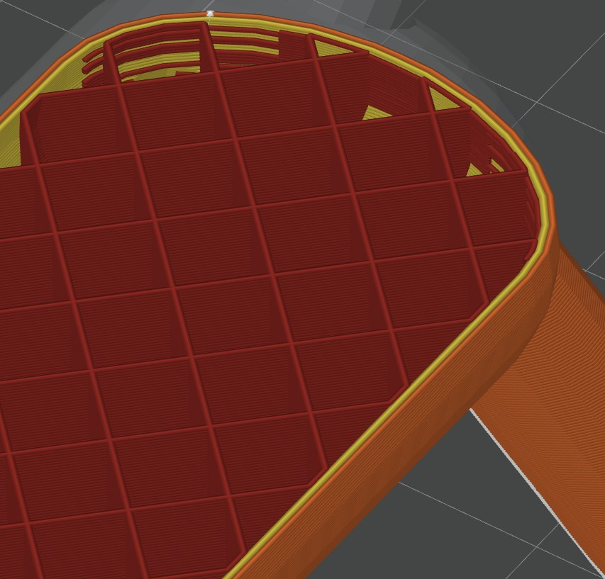|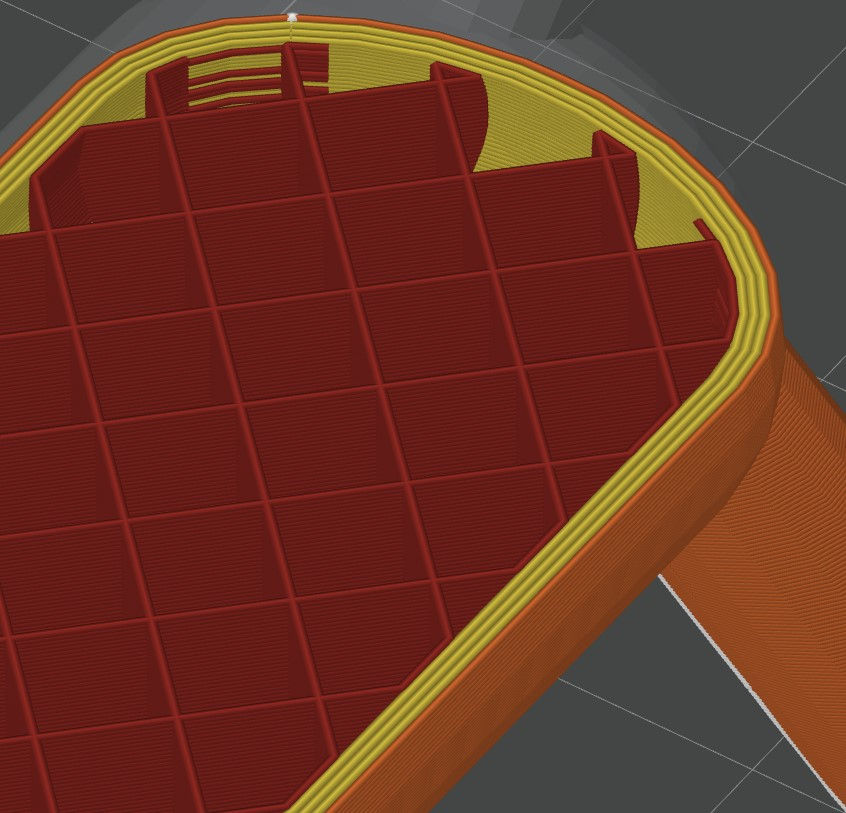|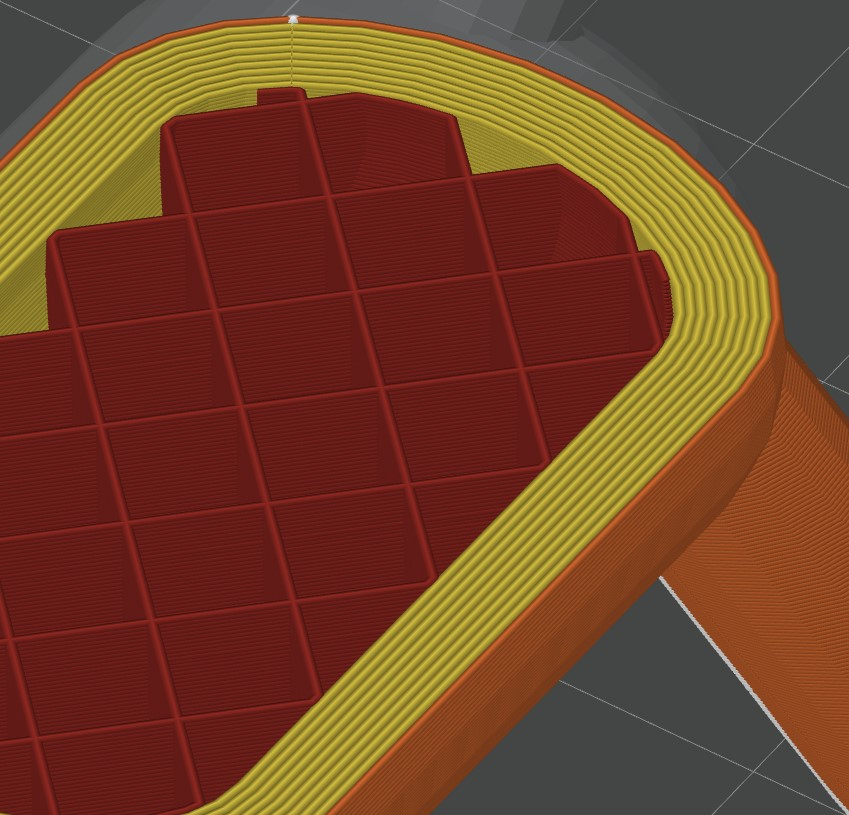|
|:--|:--|:--|
|wall count 2|wall count 4|wall count 10|
 

※本ページで使用している3Dモデルは、[Rascal The Dog](https://www.thingiverse.com/thing:520804) by neobobkrause